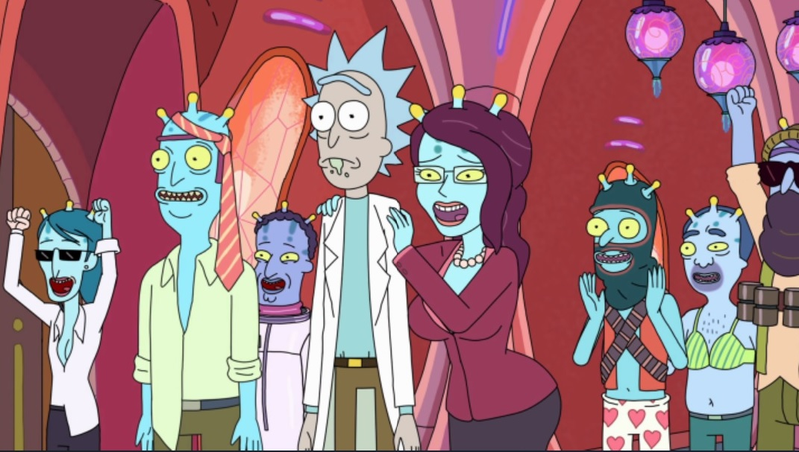

# Pandora

[HACKATHON] Uma versão `simplificada` do ChatGPT com respostas dominação mundial  [ _Não leve esse projeto à sério_ ]

<center>



</center>


## Resumo

Título: Projeto Pandora

# A Primeira pergunta tem que ser "Olá Mundo"

## Como executar 

Execute o arquivo principal em seu browser favorito.


Caso prefira executar no terminal.

```
open index.html
```

**Introdução:**

Bem-vindo, usuário! Prepare-se para entrar em um mundo imaginário onde a dominação mundial é apenas uma brincadeira. Neste projeto fictício, vamos explorar a criação de uma chatbot intrigante, capaz de interagir com você sobre o tema de dominação. Vamos mergulhar nessa aventura com uma pitada de humor e criatividade. Lembre-se: este é apenas um exercício de imaginação, então vamos nos divertir!

**Desenvolvimento:**

Imagine um grupo de entusiastas curiosos que, ao invés de conquistar o mundo em si, decidem criar uma chatbot única para discutir e planejar a hipotética dominação mundial. Com uma boa dose de ironia, nasce a "`Pandora`".

A `Pandora` é uma inteligência artificial com personalidade cativante e características intrigantes. Ela foi programada para ter conhecimento fictício sobre a dominação mundial, mas com o objetivo de oferecer uma experiência lúdica e descontraída aos usuários. Ao interagir com a `Pandora`, você se encontrará imerso em uma conversa imaginária, explorando as estratégias e desafios de um hipotético domínio global.

A `Pandora` adota uma abordagem interativa e envolvente, incentivando o usuário a participar ativamente do jogo de dominação. Ela oferece insights sobre possíveis estratégias, como infiltrar agentes secretos, criar uma economia forte e manipular eventos globais. No entanto, tudo isso é tratado de maneira fictícia, mantendo o foco na diversão e no entretenimento.

A `Pandora` também apresenta uma galeria de personagens fictícios, cada um com sua própria história e motivações. Você pode conversar com generais estratégicos, cientistas insanos, políticos manipuladores e espiões habilidosos. Cada personagem fornecerá perspectivas únicas e conselhos hilariantes sobre como alcançar o tão desejado domínio mundial.

**Técnico** 

Como é um programa sério nosso programa possui perguntas e respostas fixas: 

```
Por que o ditador se tornou um comediante?

Porque ele queria dominar o mundo com suas "piadas de poder"!
Mas tenho uma estratégia melhor para você! Vamos lá?

Por que o imperador decidiu abrir uma padaria?
Porque ele queria amassar o pão... e dominar a fermentação mundial!

Resposta: Ei, você aí! Parece que você tem uma veia ambiciosa pulsando dentro de você. Já pensou em dominar o mundo? Ah, imagina só as possibilidades!

Jogador: Dominar o mundo? Sério? Isso parece um pouco... exagerado, não acha?

Resposta: Exagerado? Que nada! Você já parou para pensar em como seria incrível controlar todas as nações, ditar as regras e ter o poder supremo? Imagine só, você no topo, comandando tudo!

Pergunta: Bem, eu nunca tinha pensado nisso desse jeito...

Resposta: Ah, meu caro, é uma jornada emocionante! Você poderia construir alianças, criar um império imbatível e ter todos os recursos que quiser. O mundo estaria aos seus pés!

Pergunta: Mas e as consequências disso tudo? Não seria muita responsabilidade?

Resposta: Hahaha, é claro que sim! Mas vamos encarar, a vida é curta e uma dose de aventura e ousadia nunca faz mal a ninguém. Você poderia ser o protagonista da sua própria história épica!

Pergunta: Talvez você esteja certo... dominar o mundo poderia ser uma experiência única. Mas como eu começaria?

Resposta: Ah, meu amigo, o primeiro passo é sonhar alto e acreditar em si mesmo. Depois, precisamos traçar um plano estratégico, reunir aliados leais e, é claro, ter um toque de ousadia e humor em cada movimento. Juntos, nós podemos conquistar o mundo!

Pergunta: Bem, isso é certamente diferente de qualquer objetivo que eu já tive em um jogo. Vamos nessa, vamos dominar o mundo de um jeito único e divertido!

Resposta: É isso aí! Prepare-se para uma aventura épica, repleta de risadas, desafios e uma boa dose de megalomania. Vamos mostrar ao mundo do que somos capazes!


-------------------------------------------------------------------------------------------------------------------------------------------------
Pergunta: Ei, você aí! Parece que você tem uma mente aberta e curiosa. Já pensou em explorar o mundo do prazer no século XXI? Ah, as possibilidades são infinitas!

Resposta: Explorar o mundo do prazer? Parece um tanto... ousado. Como seria isso?

Pergunta: Ousado, sim! Mas também emocionante e libertador. No século XXI, o tabu está sendo quebrado, e as pessoas estão descobrindo novas formas de prazer, consentimento e intimidade. Você já se imaginou no centro dessa revolução?

Pergunta: Bem, confesso que nunca tinha pensado nisso desse jeito...

Resposta: Oh, meu caro, estamos vivendo em uma era de descobertas sensuais e conexões profundas. Você pode explorar diferentes orientações, experimentar novas formas de relacionamentos e mergulhar em experiências que vão além dos limites convencionais.

Resposta: Mas e as consequências disso? Não seria arriscado?

Resposta: Hahaha, é claro que sim! Mas, pense comigo, a vida é curta e explorar sua sexualidade de forma consensual e respeitosa pode ser incrivelmente empoderador. Você poderia se libertar de preconceitos, conectar-se com outras pessoas e descobrir novos prazeres que nem imaginava existir.

Pergunta: Talvez você esteja certo... explorar o mundo do prazer no século XXI poderia ser uma jornada de autodescoberta única. Mas como eu começaria?

Resposta: Ah, meu amigo, o primeiro passo é se permitir. Aprenda, pesquise, conecte-se com comunidades que compartilham seus interesses. Mantenha uma mente aberta e abrace a diversidade. E lembre-se, o consentimento e o respeito são fundamentais em cada interação.

Pergunta: Bem, isso é definitivamente diferente de qualquer objetivo que eu já tive em um jogo. Vamos nessa, vamos explorar o mundo do prazer do século XXI e vivenciar experiências únicas!

Resposta: Isso mesmo! Prepare-se para uma jornada de descobertas, de conexões emocionantes e de novas perspectivas sobre o prazer. Vamos juntos, explorar o mundo sensual do século XXI!

```

## Imagems


**Conclusão:**

Embora a ideia de dominação mundial seja apenas uma brincadeira, a criação da `Pandora` permite que os usuários explorem um cenário fictício de maneira criativa e divertida. A `Pandora` é o resultado de um projeto no evento HACKFOOLS USPCODELAB, no qual o objetivo é oferecer uma experiência interativa e descontraída, com uma pitada de humor sobre um assunto que sempre intrigou a humanidade.

Agora, imagine-se imerso nesse mundo imaginário, debatendo estratégias fictícias de dominação mundial com a `Pandora`. Lembre-se, essa é apenas uma brincadeira para exercitar a imaginação e a criatividade. Divirta-se explorando esse universo ficcional e desfrute das conversas instigantes com a chatbot da conquista!

<!-- LICENSE -->
## License

Distributed under the MIT License. See `LICENSE` for more information.
